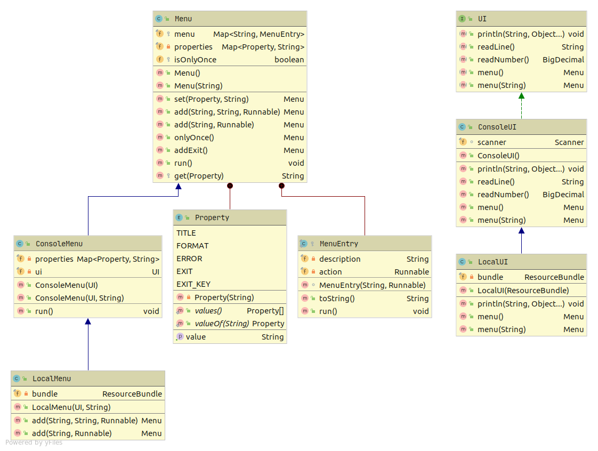

# Console Menu System

A simple class for building menus for console applications.This class was designed to make it easy to create simple console menus for educational projects in particular the project of the JetBrains Academy).

### Usage example:

```java
import ui.Menu;

public class Main {

    public static void main(String[] args) {
        final var bigClass = new BigClass("Some Configuration");

        new Menu()
                .add("Play the guessing game", new Game("Guessing Game"))
                .add("Play the sudoku", new Game("Sudoku"))
                .add("Search for an animal", Main::searchAnimal)
                .add("Entering Submenu", new Menu().onlyOnce()
                        .set(Menu.Property.TITLE, "--- Sub-Menu Title ---")
                        .set(Menu.Property.EXIT, "Back to main menu")
                        .add("The sub-menu entry", new SomeTask())
                        .add("A simple sub-menu task", () -> System.out.println("A simple task"))
                        .add("First Task in Big Class", bigClass::firstTask)
                        .add("Second Task in Big Class", bigClass::secondTask))
                .addExit()
                .run();
    }

    static void searchAnimal() {
        System.out.println("Search for an animal");
    }
}            
```

## Main classes

- Menu - base class for Menu. Uses System.out.println.
- internal public enum Property - describes properties you can set for menu
- internal protected class MenuEntry -  describes menu item

### Additional classes

- UI - interface for very simple text UI. Supports println("text/format", ...args)
- ConsoleUI - implementation for UI
- LocalUI - implementation with i18n & l10n support. You can easily add support for many languages.
- ConsoleMenu - implementation of Menu interface based on ConsoleUI
- LocalMenu - implementation based on LocalUI. 

## UML Diagrams



